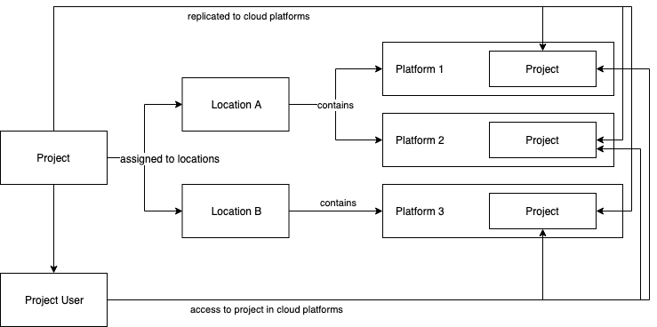

In order to use cloud computing resources, you have to create a meshProject. Within the meshProject, you can manage and scale the resources you use across all locations. Only Customer Admins have access to the administrative functionality described in this section.

## Create a new meshProject

Log on to the Meshpanel with your account credentials and press `Create`. Type in a name for your new project and press `Next`. Choose a payment method as well as your billing address and press `Next` again. In the last step, you can choose the locations from which you can obtain the cloud computing resources for your project. Press `Create Project` and you will see your new project listed in the Projects List.

## Manage meshProjects

In your **Account** section under **Projects** all meshProjects of your meshCustomer are listed. You find the **Account** section by pressing the settings icon on the top right of the mesPanel. You can execute administrative actions on your meshProjects from the **Projects** section. To edit a project, click the **pen** icon in the **Actions** column of the meshProject list. You can edit the assigned locations, payment information and the assigned users of the project.

The following diagram shows how access rights and project replication result in the correct project access for your users.

Project users always get access to all cloud platforms, that are assigned to the project.

### User Management on a meshProject

Before being able to assign a user to a meshProject, the user must have been [invited to the Meshcustomer](meshcloud.customer.md). In the **Project Users** section of the project edit screen all users of the project are listed and new ones can be added.

#### Assign user to a meshProject

In the **Project Users** section you can find a `type email` field at the bottom. You can start typing the email address of a user assigned to your Meshcustomer and select the according user in the dropdown. Also select a project role for the user. Press the `+` to actually add this user to the project. Note that only users with a valid account on the Meshpanel can access your projects.

#### Project Roles

Project Roles grant users a configured set of permissions in cloud platforms used by the project. There are currently two roles available:

- Project User: A default user, like a developer, who can manage resources in the cloud platform.
- Project Admin: An admin user, who can also change configurations of the project in the cloud platform.

Currently these Project Roles are only used in our AWS integration. But in future, this will allow more fine-grained access control in the cloud platforms. The “Mesh Project Role” will be mapped to the platform’s internal access groups.

#### Update Project Role

You can change the Project Role of a user, by choosing a different role for the user in the dropdown at the **Project Users** section, and clicking the **disc** icon afterwards to save the change.

#### Unassign user from a meshProject

In the **Project Users** section you can click the `-` button in the row of a user to remove the user from the project. This user will not be able to access this project in Meshportal and the cloud platforms anymore. You can add the user to your project again later on and he will get access again.

### Provide Payment Information for meshProject

You can configure one or multiple [payment methods](meshcloud.payment.md#payment-methods) and [billing addresses](meshcloud.payment.md#company-billing-addresses) for you meshCustomer. For a meshProject you have to select a specific one, so the project resources can be billed via a specific payment method and to a specific billing address.

### Add/remove locations from a meshProject

In the edit screen of a project, the list of all available locations is shown. Via the checkbox, new locations can be selected. They will be added to the project when clicking the `Save` button.
Locations can also be removed from the project with some limitations. All resources related to the project in that location (i.e. OpenStack instances, Cloud Foundry Apps, etc.) have to be deleted manually before removing a location.

### Delete a meshProject

If you would like to delete a project which is no longer used, go to your **Account** settings. Navigate to **Projects** and click the button with the trash icon. The system now checks whether any resources still exist for your project. If there are existing resources, you will be informed about which resources still exist. As deletion of a project is an irrevocable action, you cannot delete projects with resources. You have to delete those resources manually before to be sure that you really want to delete these resources that may contain production relevant workloads. When no resources exist anymore you have to confirm the deletion by entering the identifier of your project again. The actual project deletion in the platforms will be done in the background and may take a while.
