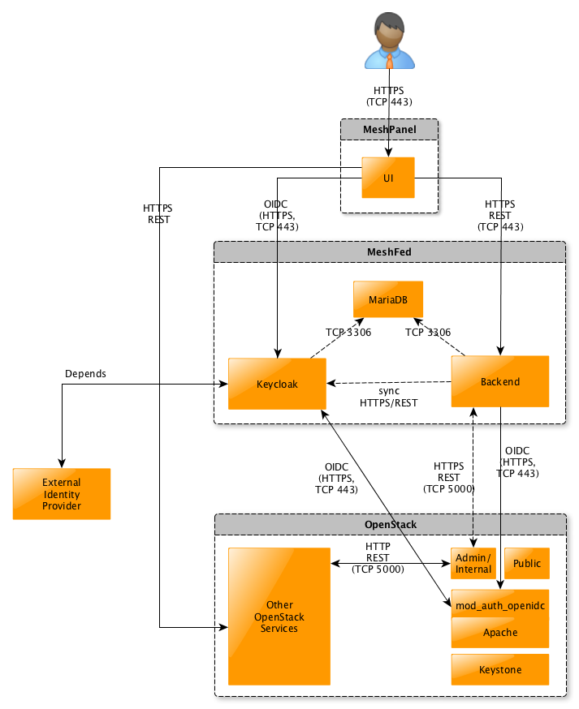
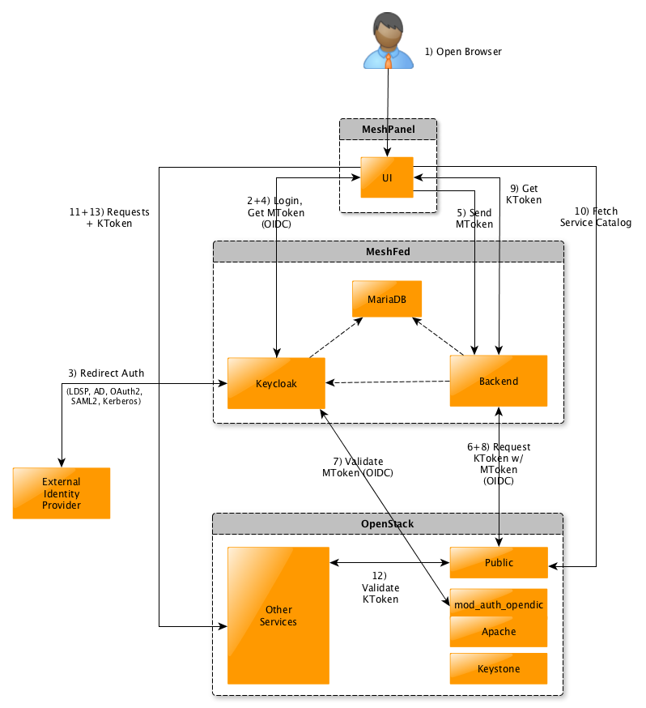

## Architektur

Der Zugriff auf OpenStack-Plattformen erfolgt durch eine förderierte Identität (federated identity), d.h. es existiert eine Vertrauensbeziehung zwischen dem für die Cloud zuständigen Auth-Dienst Keystone und dem IdP des meshStack (Keycloak). Innerhalb OpenStacks bestimmt dann Keystone über die erlaubten Zugriffe.

OpenStack Keystone delegiert die Authentifizierung im förderierten Fall an ein Apache-Modul, in unserem Fall mod_auth_openidc, das u.a. das OpenID Connect-Protokoll für verteilte Authentifizierung implementiert. Beim Zugriff auf die Cloud bringt der Nutzer ein Token mit (JWT), das vom meshStack-Keycloak ausgestellt und mit den notwendigen Zugriffsinformationen versehen wurde und von mod_auth_openidc validiert wird (s. Ablauf beim Zugriff). Der meshStack-Keycloak wiederum greift auf eine externe Identitätsquelle zurück (z.B. LDAP, zentraler IdP).

Das Meshpanel-Frontend validiert die JWT-Token ebenfalls gegen Keycloak, um dem Nutzer den notwendigen Zugriff einzuräumen.

Das Backend nutzt ebenfalls das JWT-Token, um die Berechtigungen des Users zu prüfen. Werden die Berechtigungen auf die Cloud für Nutzer über den meshStack geändert, aktualisiert das Backend die in Keycloak hinterlegten Berechtigungen für diesen User.

## OpenStack Access

1. Der User greift über den Browser auf den meshStack zu.
2. Im ausgeloggten Zustand wird der User auf Keycloak weitergeleitet, um seine Credentials einzugeben.
3. Diese Credentials werden ggf. gegen den angeschlossenen externen IdP abgeglichen (z.B. LDAP).
4. Bei erfolgreicher Anmeldung stellt Keycloak dem User ein OIDC-Token (JWT, hier MToken) aus und gibt es dem User mit in das Meshpanel, so dass der User angemeldet ist und damit arbeiten kann.
5. Für einen Cloudzugriff über das Panel, wird mit dem OIDC-Token ein entsprechender Request an das Backend gestellt.
6. Das Backend nutzt das mitgeschickte OIDC-Token, um bei Keystone (an der Cloud) wiederum ein Keystone-Token (KToken) zu erhalten. Es erfolgt also ein Token-Tausch. Der Nutzer könnte auch mit dem OIDC-Token direkt an die Cloud gehen, z.B. über CLI-Tools o.ä.
7. Der Token Exchange Request gegen Keystone führt dazu, dass mod_auth_openidc aktiv wird und das OIDC-Token validiert (Zeitliche Gültigkeit, Signatur des Keycloaks).
8. Ist das OIDC-Token gültig, leitet mod_auth_openidc den Request einschließlich User-Attributen an Keystone weiter, das bei gültigen Tokendaten ein Keystone-Token (KToken) ausstellt und zurückliefert.
9. Das Backend schickt das erhaltene KToken an das Panel, so dass dieses direkt auf die jeweiligen OpenStack-Services zugreifen kann.
10. Zunächst holt das Panel den Service Catalog von Keystone, um zu wissen, welche OpenStack Services verfügbar sind.
11. Beim Zugriff auf anderen OpenStack-Dienste wird nun das KToken gegenüber den anderen OpenStack-Diensten eingesetzt.
12. Die anderen Dienste wiederum validieren das KToken gegen Keystone.
13. Ist es valide, werden die angeforderten Requests beantwortet und der Zugriff auf die OpenStack-Dienste ist abgeschlossen.

Läuft das KToken ab, muss der OIDC/Keystone Token Exchange (6-8) erneut durchgeführt werden. Ist das OIDC-Token abgelaufen, muss der User sich erneut gegenüber dem Keycloak authentifizieren.

